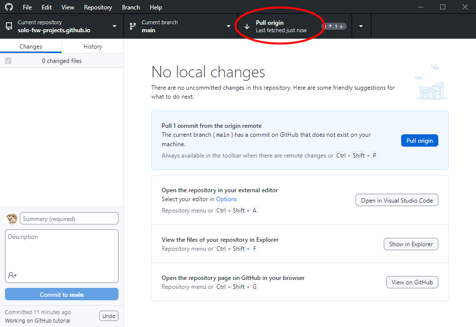

> **Note**:
> This page is work in progress!

<!-- TODO: Make templates public -->
<!-- TODO: Data directory in base. ==> !.gitignore -->
<!-- TODO: Link organizational readme to github pages -->
<!-- TODO: Cross link organizations -->

## Support disclaimer

In general, SOLO will only support software under source control, which is to say, software that can be acquired by using git.

Generally speaking, SOLO will release software under the [GNU GPL v3.0 licence](https://www.gnu.org/licenses/gpl-3.0.html), media under [CC BY-NC-SA 4.0](https://creativecommons.org/licenses/by-nc-sa/4.0/), and hardware under the [CERN Open Hardware Licence Version 2 - Strongly Reciprocal licence](https://spdx.org/licenses/CERN-OHL-S-2.0.html).

## Usage

### GitHub

SOLO uses two GitHub organizations. The solo-fsw organization contains internal projects (not for specific research groups), while the solo-fsw-projects organization contains projects done for or in collaboration with specific researcher(s) / research groups.

The repositories in both organizations follow the naming convention `<Project name/description>-<Date/Year if applicable>`. The solo-fsw-projects repos are further prepended with `<Lab/section/institute>-<PI/lead-researcher if applicable>-`. The clauses are written using lower-case letters and numbers. Underscores are used as spaces within clauses (snake_case). Dashes are used to separate clauses.

This section will introduce conventions for using some basic git functionalities and explain usage of the provided templates. A more basic explanation of git can be found [here](https://www.freecodecamp.org/news/git-and-github-for-beginners/) (or [here](https://marklodato.github.io/visual-git-guide/index-en.html) or [here](https://learngitbranching.js.org/)).

#### GitHub usage

For day to day git usage, we recommend using [GitHub Desktop](https://desktop.github.com/). GitHub Desktop is a graphical interface for git usage, which makes git more approachable for beginners. Nevertheless, the explanation below will also provide CLI commands.

##### Cloning a repository

In order to use a repository under version control, one must first clone it, which, in essence, creates a copy of the repository on your local machine (called the local repository), which can then be used to track modifications on the online repository (called the remote repository).

Cloning a repository by using the CLI involves going to the repository's webpage, copying the link, and using it in the following command:

```bash
git clone https://github.com/AUTHOR/REPO_NAME.git
```

Where the example link is replaced with the link you found on GitHub.

Cloning a repository by using GitHub Desktop is easier. Go to `file > Clone repository` and then select the correct repository. Pressing the `clone` button will then clone that repository.


Once you have cloned a git repository, it is very easy to keep it up to date with its online counterpart. CLI users need to use the command `git pull`, while GitHub Desktop users need to press the `Fetch origin` button, which will change into a `Pull origin` button if changes were detected. Pressing this button will update your local repository.




##### Making changes to a cloned repository

> **Note**: We advise branching out before adding, committing and pushing any changes you make. This will be explained in the next section: [Using branches](#using-branches)

If you wish to make changes to a cloned repository, you can simply change your local copy. Git will track and list your changes. CLI users can use `git status` to see their changes files. GitHub desktop lists them on the left side of the screen.


In order to make your changes permanent (add them to the git source control history) we need to stage them, and them commit them to the repository. CLI users can stage and commit changes with (a combination of) the following commands:

```bash
git add .  # This adds all edited files to the staging area
git add example/README.md  # This only adds README.md from the directory "example" to the staging area
git commit -m "COMMIT MESSAGE"  # This commits all files in the staging area to the repository. They are annotated with the COMMIT MESSAGE
```

GitHub desktop also uses this workflow, but it is streamlined, since adding files to the working area is included in committing them. By using the checkboxes in the "status panel", you can choose which files are to be added to the staging area. The summary field should then be used to write a commit message, and the `Commit to <BRANCHNAME>` button can then be used to commit the changes.

##### Using branches

When making changes to a repository, we advise you to create a branch. Branches provide a way of keeping different changes separated, and provide an easy way to revert changes in case of unexpected consequences.

By default, your repository will have one branch (usually called `main`). The important CLI commands for using branches are:

```bash
git branch BRANCH_NAME  # Create a new branch
git checkout BRANCH_NAME  # Switch to a branch
git checkout -b BRANCH_NAME  # Create a new branch and imedeately switch to it
```

Once you are finished in a branch, you can combine it into another branch (usually `main`) by using the `git merge` command from the branch that you want to merge. Checking your current branch can be done through `git status`.

In GitHub Desktop, the branching operations can be found by extending the `Current branch` menu.


We advise creating a new branch for each feature you wish to implement. However, this is more a preference / standard and is far from a strict requirement.

#### Template usage

In order to standardize the structure of SOLO repositories, we created a few template repositories.

The most basic repository template is called [solo-base_repo_template](https://github.com/solo-fsw-projects/solo-base_repo_template). This template contains the bare minimum structure we expect to find in a repository, which is:

- A *README* file for writing documentation / additional explanation about the project
- A *LICENCE* file containing the [GNU GPL v3.0 licence](https://www.gnu.org/licenses/gpl-3.0.html)
- A *.gitignore* file for specifying files that are to be ignored by git (like, for example, data files)
- A *readme-media* directory for including media in the README file
<!-- TODO: Metadata.yml file -->

<!-- SOLO repositories should contain a project-metadata.yml file with the following fields

Base repo: Metadata file (project-metadata.yml)
- PI
- Researchers
- Lab
- Unit
- Institute
- Faculty
- Entity
- StartTime
- EndTime
- Status
- ProjectName
- ProjectDesc
- SupportStaff
- SoloProjectOwner
- ResearchProjectOwner -->

The base template was extended into two other templates, each with a specific purpose in mind. The [solo-python_package_repo_template](https://github.com/solo-fsw-projects/solo-python_package_repo_template) contains additional structure for creating (and distributing) a python project for pip using GitHub. The [solo-software_hardware_repo_template](https://github.com/solo-fsw-projects/solo-software_hardware_repo_template) contains additional structure aimed at projects involving both software and hardware.

### Python

Python is a very commonly used programming language. Below, we give a few pointers for the use of python.

#### Code editors

With regard to code editors, we advise the usage of either [Visual Studio Code](https://code.visualstudio.com/download) (vscode) or [Spyder](https://www.spyder-ide.org/). We advise vscode because of its extensibility and its integration with the IPython kernel, while we advise Spyder because of its ease of use with Anaconda.

#### Packaging

We advise the use of either the _pip_ or _conda_ package manager. The usage of anaconda virtual environments is recommended.

In order to create an anaconda environment, simply use the following command (replacing `ENVIRONMENT_NAME` with the desired environment name):

```bash
conda create --name ENVIRONMENT_NAME
```

Packages often recommend a specific python version. If you want to change the python version used for the creation of the virtual environment, the following command can be used:

```bash
conda create --name ENVIRONMENT_NAME python=VERSION
```

This command will create a virtual environment. That environment can then be activated by using the command:

```bash
conda activate ENVIRONMENT_NAME
```

After activating the environment, packages can be installed into it by using either pip or conda:

```bash
conda install PACKAGE_NAME
pip install PACKAGE_NAME
```

The conda command is advised over `pip install PACKAGE_NAME`, since this allows anaconda to track package versions. If you need to use `pip` for a certain install, ensure this is the last package you install, since the conda will sometimes fail to install new packages after pip was used.

When installing packages, the `-c` flag can be used to specify the origin of the package. An example is given below:

```bash
conda install -c CHANNEL_NAME PACKAGE_NAME
```

Often used channels are `conda-forge` and `cogsci`.

Sometimes packages can be installed straight from GitHub. This requires the usage of pip with the command:

```bash
pip install git+GITHUB_REPO_LINK
```

You can see what packages (and package versions) are installed in a specific environment by using the command:

```bash
conda list
```

Adding a package name after the `conda list` command will trigger a search for that specific package, only listing that package and/or packages with similar names.

The active anaconda environment can be converted into a `.yml` file using the command:

```bash
conda env export > FILENAME.yml
```

`environment.yml` files can be used to create new anaconda environments and are therefore the recommended way to clone virtual environments. When using an `environment.yml` file, an anaconda environment can be created as follows:

```bash
conda create -f PATH/TO/FILE/environment.yml 
```

## References

A few lists, tables, or other references that might come in handy.

### Unit shorthand

<!-- TODO -->

Official shorthand for the different units we deal with.

<!-- TODO: Optional -->
<!-- ### Project list -->
<!-- Organization level GitHub list of projects? → JS from metadata files -->


<!-- 
This repository specifies the most basic structure of repositories used by SOLO. The other repository templates are extensions on this base template. Media files for this README can be found in the `readme-media` directory.

The remainder of this README file contains a few notes on repository naming conventions, and a support disclaimer.

## Naming conventions

.


 
### Examples in solo-fsw-projects

- copan-juan_perea-manometer
- copan-fabiola_diana-prisoners_dilemma-2023
- copan-fabiola_diana-julia_folz-pdt_converter-2023
- prsm-josi_marschall-bodhi
- prsm-lowlands-2023
 
### Examples in solo-fsw

- digitimer-ds-controller
- python-markers

## Support disclaimer

What follows is a disclaimer regarding SOLO support for (mainly software) projects. We advise adding it to the root README of projects in order to encourgae researchers to use git, which in turn makes support in software development easier.

### Disclaimer
SOLO project support often includes support in the development of software. We wish to limit this support to software that is being kept under version control (read: software that uses git) in order to make support easier. As such, if your software is not under version control, we will not offer support for it. -->
