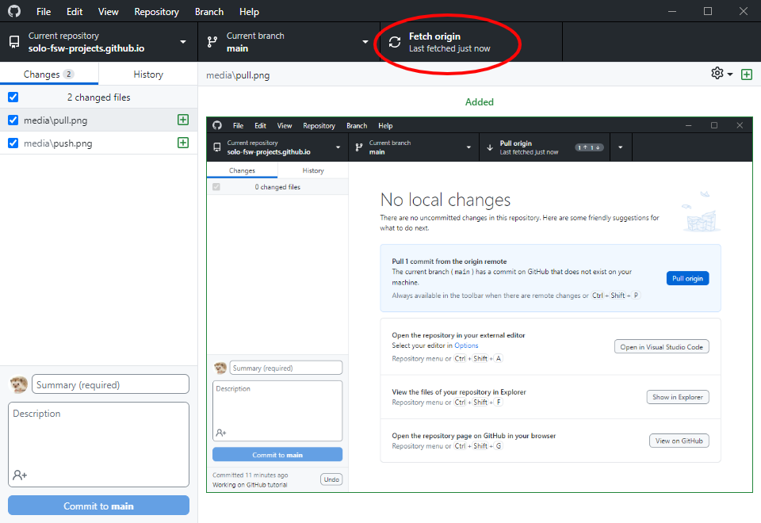
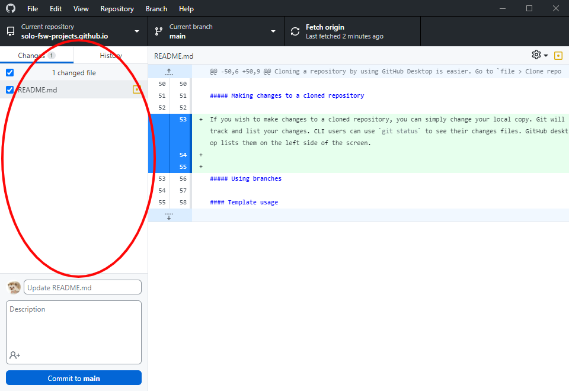

# Technical Support Disclaimer
The [SOLO FSW](https://github.com/solo-fsw) and [SOLO FSW Projects](https://github.com/solo-fsw-projects) organizations are maintained by the Lab and Research Support teams of SOLO department at Leiden University's Social and Behavioural Sciences faculty. Please visit our [wiki](https://researchwiki.solo.universiteitleiden.nl/) for information about the [teams](https://researchwiki.solo.universiteitleiden.nl/xwiki/wiki/researchwiki.solo.universiteitleiden.nl/view/Support/About%20Us/) and about our [support policy](https://researchwiki.solo.universiteitleiden.nl/xwiki/wiki/researchwiki.solo.universiteitleiden.nl/view/Support/Support%20Policy/).

> **Note**: SOLO will only provide support for projects kept under source control, when applicable. As such, when projects are delivered via GitHub, collaborators are required to keep their changes under source control if continued support is desired.

Unless otherwise specified, SOLO releases software under the [GNU GPL v3.0 license](https://www.gnu.org/licenses/gpl-3.0.html), media under [CC BY-NC-SA 4.0](https://creativecommons.org/licenses/by-nc-sa/4.0/), and hardware under the [CERN Open Hardware License Version 2 - Strongly Reciprocal license](https://spdx.org/licenses/CERN-OHL-S-2.0.html).

# Using GitHub and GitHub Desktop
Basic explanations of git and its core concepts can be found [here](https://www.freecodecamp.org/news/git-and-github-for-beginners/) (or [here](https://marklodato.github.io/visual-git-guide/index-en.html) or [here](https://learngitbranching.js.org/)).

For most users, we strongly recommend using [GitHub Desktop](https://desktop.github.com/), a very user-friendly graphical interface for git.

## Cloning a Repository
In order to use a repository under version control, one must first clone it, which, in essence, creates a copy of the repository on your local machine (called the local repository), which can then be used to track modifications on the online repository (called the remote repository).

To clone a repository using GitHub Desktop go to `file > Clone repository` and then select the correct repository. Pressing the `clone` button will then clone that repository.


Once you have cloned a git repository, it is very easy to keep it up to date with its online counterpart. To do this using GitHub Desktop, press the `Fetch origin` button, which will change into a `Pull origin` button if changes were detected. Pressing this button will update your local repository.




## Editing a Cloned Repository

> **Note**: We advise making a new branch before adding, committing and pushing any changes you make. This will be explained in the next section: [Using Branches](#using-branches)

If you wish to make changes to a cloned repository, you can simply change your local copy. Git will track and list your changes, which GitHub Desktop lists on the left side of the screen.



In order to make your changes permanent (add them to the git source control history) we need to select (aka _stage_) the modified files, _commit_ those changes, and _push_ them to the remote repo. In GitHub desktop, enabling files to be committed (aka staged) is done using the checkboxes in the "status panel", which are all enabled by default. The summary field should then be used to write a commit message, and the `Commit to <BRANCHNAME>` button can then be used to commit the changes to the local repo. Once the local repo features commits not on the remote, the `push origin` button will appear, which can be used to push the local changes to the remote repo on GitHub. This will allow other collaborators to pull those changes to their local copies.

## Using branches
When making changes to a repository, we advise you to create a branch. Branches provide a way of keeping different changes separated, and provide an easy way to revert changes in case of unexpected consequences.

By default, your repository will have one branch (usually called `main`). However, software delivered by SOLO may be in different branches (e.g. development) depending on the stage of the project. In GitHub Desktop, the branching operations can be found by extending the `Current branch` menu.


We advise creating a new branch for each feature you wish to implement. However, this is more a preference / standard and is far from a strict requirement.

# Python
Many of SOLO's software projects are written in Python and make use of the conda environment management system.

With regards to opening and/or editing the Python source files, for most users, we advise using [Visual Studio Code](https://code.visualstudio.com/download) (aka vscode) due to its ease of use,  extensibility and good compatibility with conda and the iPython kernel.

To generate the correct environment in which to run the Python code, you must first install [Anaconda](https://www.anaconda.com/download/success). Then, use the environment definition file (a .yml file) provided in the repo to generate the environment.


## Pip and Conda CLI Commands
We advise the use of either the _pip_ or _conda_ package manager. The usage of anaconda virtual environments is recommended.

In order to create an anaconda environment, simply use the following command (replacing `ENVIRONMENT_NAME` with the desired environment name):

```bash
conda create --name ENVIRONMENT_NAME
```

Packages often recommend a specific python version. If you want to change the python version used for the creation of the virtual environment, the following command can be used:

```bash
conda create --name ENVIRONMENT_NAME python=VERSION
```

This command will create a virtual environment. That environment can then be activated by using the command:

```bash
conda activate ENVIRONMENT_NAME
```

After activating the environment, packages can be installed into it by using either pip or conda:

```bash
conda install PACKAGE_NAME
pip install PACKAGE_NAME
```

The conda command is advised over `pip install PACKAGE_NAME`, since this allows anaconda to track package versions. If you need to use `pip` for a certain install, ensure this is the last package you install, since the conda will sometimes fail to install new packages after pip was used.

When installing packages, the `-c` flag can be used to specify the origin of the package. An example is given below:

```bash
conda install -c CHANNEL_NAME PACKAGE_NAME
```

Often used channels are `conda-forge` and `cogsci`.

Sometimes packages can be installed straight from GitHub. This requires the usage of pip with the command:

```bash
pip install git+GITHUB_REPO_LINK
```

You can see what packages (and package versions) are installed in a specific environment by using the command:

```bash
conda list
```

Adding a package name after the `conda list` command will trigger a search for that specific package, only listing that package and/or packages with similar names.

The active anaconda environment can be converted into a `.yml` file using the command:

```bash
conda env export > FILENAME.yml
```

`environment.yml` files can be used to create new anaconda environments and are therefore the recommended way to clone virtual environments. When using an `environment.yml` file, an anaconda environment can be created as follows:

```bash
conda create -f PATH/TO/FILE/environment.yml 
```

# Contributing to SOLO FSW and SOLO FSW Projects
## Naming Conventions
Repositories in both organizations should follow the naming convention `<Project name/description>-<Date/Year if applicable>`. The solo-fsw-projects repos are further prepended with `<Lab/section/institute>-<PI/lead-researcher if applicable>-`. The names should contain only lower-case letters, numbers and dashes.

The official shorthands for all the research units for which SOLO provides support is presented below.

| Abbreviation | Dutch unit name                                    | English unit name                              |
| ------------ | -------------------------------------------------- | ---------------------------------------------- |
| IPW          | Instituut Pedagogische Wetenschappen               | Institute of Education and Child Studies       |
| FGJ          | Forensische gezinspedagogiek en jeugdhulpverlening | Forensic Family and Youth Care Studies         |
| L&GO         | Leer- en gedragsproblemen in het onderwijs         | Learning and Behaviour Problems in Education   |
| NPOS         | Neuropedagogiek en ontwikkelingsstoornissen        | Clinical Neurodevelopmental Sciences           |
| ONWS         | Onderwijswetenschappen                             | Educational Sciences                           |
| O&O (IPW)    | Opvoeding en ontwikkeling                          | Parenting, Child Care and Development          |
| OMS          | Onderzoeksmethoden en statistiek                   | Research Methods and Statistics                |
| PSY          | Psychologie                                        | Psychology                                     |
| COG          | Cognitieve Psychologie                             | Cognitive Psychology                           |
| GMN          | Gezondheids-, Medische en Neuropsychologie         | Health, Medical and Neuropsychology            |
| KP           | Klinische Psychologie                              | Clinical Psychology                            |
| MS           | Methodologie en Statistiek                         | Methodology and Statistics                     |
| O&O (PSY)    | Ontwikkelings- en Onderwijspsychologie             | Developmental and Educational Psychology       |
| SE&O         | Sociale, Economische en Organisatiepsychologie     | Social, Economic and Organizational Psychology |


## Templates
In order to standardize the structure of SOLO repositories, we created a few template repositories.

The most basic repository template is called [solo-base_repo_template](https://github.com/solo-fsw-projects/solo-base_repo_template). This template contains the bare minimum structure we expect to find in a repository, which is:

- A *README* file for writing documentation / additional explanation about the project
- A *LICENSE* file containing the [GNU GPL v3.0 license](https://www.gnu.org/licenses/gpl-3.0.html)
- A *.gitignore* file for specifying files that are to be ignored by git (like, for example, data files)
- A *readme-media* directory for including media in the README file
- A *metadata.yml* file containing a _YAML_ format for providing metadata about the project

The base template was extended into two other templates, each with a specific purpose in mind. The [solo-python_package_repo_template](https://github.com/solo-fsw-projects/solo-python_package_repo_template) contains additional structure for creating (and distributing) a python project for pip using GitHub. The [solo-software_hardware_repo_template](https://github.com/solo-fsw-projects/solo-software_hardware_repo_template) contains additional structure aimed at projects involving both software and hardware.
