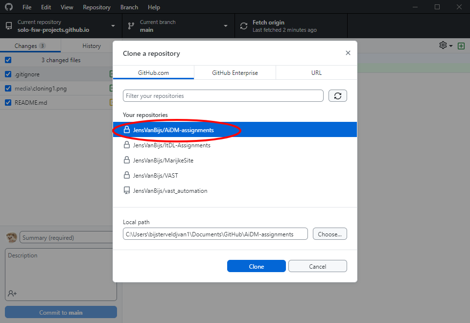

# Introduction

> **Note**:
> This page is work in progress!

<!-- TODO: Make templates public -->
<!-- TODO: Data directory in base. ==> !.gitignore -->
<!-- TODO: Link organisational readme to github pages -->
<!-- TODO: Cross link organisations -->

This page provides

## Support disclaimer

In general, SOLO will only support software under source control, which is to say, software that can be acquired by using git.

Generally speaking, SOLO will release software under the [GNU GPL v3.0 licence](https://www.gnu.org/licenses/gpl-3.0.html), media under [CC BY-NC-SA 4.0](https://creativecommons.org/licenses/by-nc-sa/4.0/), and hardware under the [CERN Open Hardware Licence Version 2 - Strongly Reciprocal licence](https://spdx.org/licenses/CERN-OHL-S-2.0.html).

## Usage

### GitHub

SOLO uses two GitHub organizations. The solo-fsw organization contains internal projects (not for specific research groups), while the solo-fsw-projects organization contains projects done for or in collaboration with specific researcher(s) / research groups.

The repositories in both organizations follow the naming convention `<Project name/description>-<Date/Year if applicable>`. The solo-fsw-projects repos are further prepended with `<Lab/section/institute>-<PI/lead-researcher if applicable>-`. The clauses are written using lower-case letters and numbers. Underscores are used as spaces within clauses (snake_case). Dashes are used to separate clauses.

This section will introduce conventions for using some basic git functionalities and explain usage of the provided templates. A more basic explanation of git can be found [here](https://www.freecodecamp.org/news/git-and-github-for-beginners/) (or [here](https://marklodato.github.io/visual-git-guide/index-en.html) or [here](https://learngitbranching.js.org/)).

#### GitHub usage

For day to day git usage, we recommend using [GitHub Desktop](https://desktop.github.com/). GitHub Desktop is a graphical interface for git usage, which makes git more approachable for beginners. Nevertheless, the explanation below will also provide CLI commands.

##### Cloning a repository

In order to use a repository under version control, one must first clone it, which, in essence, creates a copy of the repository on your local machine (called the local repository), which can then be used to track modifications on the online repository (called the remote repository).

Cloning a repository by using the CLI involves going to the repository's webpage, copying the link, and using it in the following command:

```bash
git clone https://github.com/AUTHOR/REPO_NAME.git
```

Where the example link is replaced with the link you found on GitHub.

Cloning a repository by using GitHub Desktop is easier. Go to `file > Clone repository` and then select the correct repository. Pressing the `clone` button will then clone that repository.




##### Making changes to a cloned repository

##### Using branches

#### Template usage

We created a few templates for repositories, explained here.

SOLO repositories should contain a project-metadata.yml file with the following fields

<!-- Base repo: Metadata file (project-metadata.yml) -->
- PI
- Researchers
- Lab
- Unit
- Institute
- Faculty
- Entity
- StartTime
- EndTime
- Status
- ProjectName
- ProjectDesc
- SupportStaff
- SoloProjectOwner
- ResearchProjectOwner

### Python

Python is a very commonly used programming language. Below are a few pointers for workflow, packages, etc.

vscode
spyder
conda
pip

## References

Few references that might come in handy

### Unit shorthand

Official shorthand for the different units we deal with.

### Project list

Organization level GitHub list of projects? → JS from metadata files


<!-- 
This repository specifies the most basic structure of repositories used by SOLO. The other repository templates are extensions on this base template. Media files for this README can be found in the `readme-media` directory.

The remainder of this README file contains a few notes on repository naming conventions, and a support disclaimer.

## Naming conventions

.


 
### Examples in solo-fsw-projects

- copan-juan_perea-manometer
- copan-fabiola_diana-prisoners_dilemma-2023
- copan-fabiola_diana-julia_folz-pdt_converter-2023
- prsm-josi_marschall-bodhi
- prsm-lowlands-2023
 
### Examples in solo-fsw

- digitimer-ds-controller
- python-markers

## Support disclaimer

What follows is a disclaimer regarding SOLO support for (mainly software) projects. We advise adding it to the root README of projects in order to encourgae researchers to use git, which in turn makes support in software development easier.

### Disclaimer
SOLO project support often includes support in the development of software. We wish to limit this support to software that is being kept under version control (read: software that uses git) in order to make support easier. As such, if your software is not under version control, we will not offer support for it. -->
